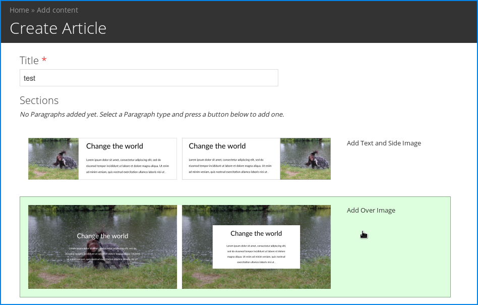

# Paragraphs Thumbs

Provides thumbnails examples instead of the [Paragraphs module](https://www.drupal.org/project/paragraphs) add buttons.

## Usage

Create a directory `paragraphs-thumbs` inside your public files dir. In here you
can put 600px wide PNG images named using the machine names of your paragraphs
bundles.

This image will then replace the standard submit button for adding a paragraph
of that style.

## Author

[Artful Robot](https://artfulrobot.uk) - Stitching together the best open source technologies to help campaigns, charities and not-for-profits communicate beautifully.
